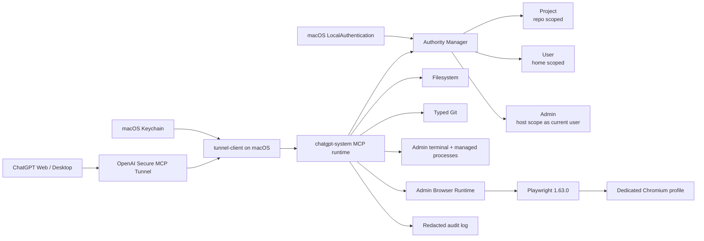

# chatgpt-system

<p align="center">
  <a href="https://github.com/senoldogann/chatgpt-system/actions/workflows/ci.yml"></a>
  
  
  
  
  
</p>

Secure local MCP authority gateway for controlled filesystem, Git, process, and browser automation from ChatGPT-compatible MCP clients.

`chatgpt-system` is deliberately not a permanently privileged natural-language shell. Authority is explicit, scoped, expiring, revocable, auditable, and enforced on the Mac. Browser automation follows the same rule instead of quietly becoming a side door around it.

## At a glance

| Capability | What it provides |
| --- | --- |
| **Secure MCP Tunnel** | Outbound-only personal ChatGPT connectivity without exposing a raw public MCP port |
| **Scoped authority** | Project, User, and Admin profiles with fixed local privilege boundaries |
| **Filesystem + Git** | Confined file operations plus typed Git read/write primitives |
| **Admin execution** | Allowlisted `shell=false` commands and managed development processes |
| **Browser Runtime** | Admin-only semantic Playwright automation, screenshots, and bounded browser diagnostics |
| **Computer Runtime v2 foundation** | Standalone Swift/macOS 14+ helper for passive readiness, bounded app/window + AX observation, and ScreenCaptureKit screenshots over inherited NDJSON stdio |
| **macOS trust** | LocalAuthentication for broad authority and Keychain-backed daily-driver credentials |
| **Daily driver** | LaunchAgent startup, automatic tunnel reconnect, bounded logs, and no routine Terminal ceremony |

## Architecture



The tunnel is transport, not authority. Privilege decisions remain local to the Mac. Admin still runs as the current macOS user rather than root. Browser automation is an independently gated Admin capability and is not a network or OS sandbox.

## Current implementation

The shared runtime currently includes:

- MCP TypeScript SDK v2 / 2026-07-28 protocol support;
- stdio and authenticated Streamable HTTP transports;
- personal ChatGPT Plugin path through OpenAI Secure MCP Tunnel;
- Project / User / Admin authority leases;
- direct Project authority from MCP with no terminal/browser content capability;
- local User/Admin authorization through a private Unix socket and macOS LocalAuthentication;
- optional explicit personal-admin mode for a private daily-driver workstation;
- protected root-owned native approval helper with pinned SHA-256 metadata;
- filesystem confinement, symlink escape protection, optimistic SHA-256 mutation guards, and atomic replacement;
- typed Git status/diff/log/branch/stage/commit/merge/push operations;
- Admin-only allowlisted one-shot execution with `shell=false`;
- Admin-only managed process supervision with opaque IDs, bounded logs, and POSIX process-group cleanup;
- Admin-only deterministic Playwright Browser Runtime with semantic targeting and bounded diagnostics;
- browser credential-entry refusal and editable ARIA value redaction;
- standalone Swift 6/macOS 14+ Computer Runtime v2 helper with strict bounded NDJSON over inherited stdin/stdout;
- passive Accessibility/Screen Recording readiness, bounded app/window + AX observation, and an 8 MiB ScreenCaptureKit screenshot path;
- deterministic background `.app` staging with fixed bundle ID `com.senoldogann.chatgpt-system.computer-runtime`;
- no physical mouse/keyboard input and no `computer_*`, `computer_run`, or `computer_run_js` MCP registration yet;
- JSONL audit trail with redacted authority/process/browser metadata;
- localhost Host/Origin validation for HTTP mode;
- Node 22 / Node 24 CI plus native macOS build/install verification.

Computer Runtime v2 Slice 1 now provides the standalone native perception foundation. It is intentionally not wired into MCP yet. Physical mouse/keyboard input, verification/recovery, `computer_*` registration, `computer_run`, and `computer_run_js` remain later slices rather than being smuggled into the Browser Runtime.

## Requirements

- Node.js 22 or newer
- npm
- Git
- macOS + Swift/Xcode command-line tools for native User/Admin approval; the standalone Computer Runtime v2 helper specifically requires macOS 14+
- `tunnel-client` when using the personal ChatGPT Plugin route
- Chromium installed through the repository-pinned Playwright CLI when Browser Runtime is enabled

## Install and verify

```bash
git clone https://github.com/senoldogann/chatgpt-system.git
cd chatgpt-system
npm install
npm run check
```

For local stdio development:

```bash
npm run dev -- stdio --root /absolute/path/to/project
```

## Browser Runtime

Browser automation is disabled by default. Install the pinned Chromium binary once:

```bash
npm run setup:browser
```

The setup command accepts no browser/channel/command override. It invokes the repository-pinned Playwright CLI for Chromium with a bounded child-process lifetime.

Enable Browser Runtime explicitly:

```bash
npm run dev -- stdio \
  --root /absolute/path/to/project \
  --enable-browser
```

Optional headless mode:

```bash
npm run dev -- stdio \
  --root /absolute/path/to/project \
  --enable-browser \
  --browser-headless
```

Default browser configuration:

```text
CHATGPT_SYSTEM_ENABLE_BROWSER=false
CHATGPT_SYSTEM_BROWSER_HEADLESS=false
CHATGPT_SYSTEM_BROWSER_TIMEOUT_MS=10000
CHATGPT_SYSTEM_BROWSER_USER_DATA_DIR=~/.chatgpt-system/browser-profile
```

The default user-data directory is intentionally a dedicated automation profile. Do not point normal automation at your everyday Chrome/Chromium profile unless you deliberately accept the additional exposure.

### Browser authority boundary

`browser_health` is lease-free and returns only categorical readiness.

All other browser tools require an active Admin lease because tabs, URLs, page content, screenshots, console output, and network diagnostics can reveal authenticated user-session information unrelated to a Project/User filesystem scope.

Project and User leases therefore cannot inspect or mutate browser content.

### Browser target model

Browser actions accept semantic targets only:

```text
role
text
label
testId
```

Raw CSS/XPath selectors, arbitrary JavaScript, generated Playwright code, cookies/storage APIs, CDP endpoints, proxy settings, executable paths, browser flags, request interception, and file-upload primitives are not exposed through MCP.

Navigation accepts only `http:` and `https:` URLs. Credential-shaped fields such as passwords, OTPs, verification codes, and payment-card secrets are refused before input reaches Playwright. Editable ARIA values are redacted before snapshots leave the runtime.

Browser actions are serialized through one runtime-owned operation chain so concurrent sessions cannot race tab/focus mutations inside the owned context.

## Computer Runtime v2 native foundation

Slice 1 builds a standalone Swift helper under `native/macos-computer-runtime`. This helper requires macOS 14+ and communicates only over inherited stdin/stdout using strict bounded NDJSON. Its native protocol currently supports passive `health`, bounded `list_apps`, AX-first `active_window` / `observe`, and bounded ScreenCaptureKit `screenshot`.

Build, test, and stage the fixed background app bundle with:

```bash
npm run test:computer:macos
npm run build:computer:macos
npm run package:computer:macos
```

The default staged bundle is:

```text
native/macos-computer-runtime/.build/staged/ChatGPTSystemComputerRuntime.app
```

Its bundle identifier is fixed to `com.senoldogann.chatgpt-system.computer-runtime`. `health` uses passive TCC preflight checks only and does not request Accessibility or Screen Recording permission. Screenshot capture stays in memory and enforces an 8 MiB PNG limit before base64 encoding.

Slice 1 has **no physical mouse/keyboard input**, no native listener, no `computer_*` MCP tools, and no `computer_run` / `computer_run_js`. The existing Browser Runtime remains the only GUI/web automation surface exposed through MCP in this release.

## Personal ChatGPT Plugin

For a personal ChatGPT Developer Mode plugin, use OpenAI Secure MCP Tunnel so the Mac does not expose a public inbound MCP port.

Create the tunnel in OpenAI Platform, then configure the local profile. For the full daily-driver capability set including browser:

```bash
npm run setup:chatgpt -- \
  --root /absolute/path/to/disposable-test-project \
  --tunnel-id tunnel_xxxxxxxxxxxxxxxx \
  --enable-terminal \
  --personal-admin \
  --enable-browser \
  --doctor
```

The generated tunnel child command always enables the private local authority control socket. `--enable-terminal`, `--personal-admin`, and `--enable-browser` are separate explicit trust decisions. Omitting any of them preserves that capability's secure default.

Headless browser mode is optional:

```bash
npm run setup:chatgpt -- \
  --root /absolute/path/to/disposable-test-project \
  --tunnel-id tunnel_xxxxxxxxxxxxxxxx \
  --enable-terminal \
  --personal-admin \
  --enable-browser \
  --browser-headless \
  --doctor
```

`--browser-headless` without `--enable-browser` is rejected.

If the `chatgpt-system` tunnel profile already exists and its child command is stale, replacement is intentionally explicit. Re-run setup with `--force`:

```bash
npm run setup:chatgpt -- \
  --root /absolute/path/to/disposable-test-project \
  --tunnel-id tunnel_xxxxxxxxxxxxxxxx \
  --enable-terminal \
  --personal-admin \
  --enable-browser \
  --force \
  --doctor
```

`--force` replaces only the existing `tunnel-client` profile configuration. It does not delete repository data or bypass authority policy.

Run manually with:

```bash
tunnel-client run --profile chatgpt-system
```

ChatGPT Web is the canonical first acceptance surface. Desktop uses the same installed plugin/backend. Normal Chat and Work may route product safety differently, so actual MCP calls are the acceptance evidence that matters.

See [docs/CHATGPT_INTEGRATION.md](docs/CHATGPT_INTEGRATION.md) for the full runbook.

## macOS daily driver

After the tunnel profile is configured, the optional daily-driver service can keep `tunnel-client` running automatically at login. The one-time installer stores `CONTROL_PLANE_API_KEY` in the macOS login Keychain and installs a user LaunchAgent.

Before installing, stop any manually running tunnel process. Then run once from a shell where the credential is already available:

```bash
npm run setup:daily-driver
```

Maintenance commands:

```bash
npm run daily-driver:status
npm run daily-driver:uninstall
```

The LaunchAgent runs as the logged-in user. The tunnel credential is not written to the plist, repository, audit log, runner logs, or spawned command argv.

## Authority privilege ladder

Every privileged filesystem/Git/process/browser-content call carries an opaque `authorityLeaseId`. The capability mapping is fixed by trusted local code and cannot be overridden by MCP input.

| Profile | Scope | Maximum lease | Terminal/process | Browser content/actions | Authority creation |
| --- | --- | ---: | --- | --- | --- |
| `project` | Explicit project root(s) | 8 hours | No | No | MCP `session_authority_start` |
| `user` | Canonical current-user home | 4 hours | No | No | Local CLI + macOS authentication |
| `admin` | `/` host-wide scope under current OS user | 1 hour | Yes when runtime gate enabled | Yes when browser gate enabled | Local CLI by default; MCP direct in personal-admin mode |

### Project authority

Project mode is the default for normal repository work:

```text
session_authority_start({
  profile: "project",
  projectRoots: ["/Users/you/Projects/my-app"]
})
```

It supports filesystem and built-in Git tools inside selected roots. `/` and the entire user home directory are rejected as Project roots.

### User/Admin local authorization

By default broad authority starts physically on the Mac:

```bash
chatgpt-system authorize user
chatgpt-system authorize admin
```

The flow is:

```text
local CLI
   |
   v
~/.chatgpt-system/control.sock
   |
   v
protected root-owned LocalAuthentication helper
   |
   v
same in-memory AuthorityManager
   |
   v
expiring lease
```

The normal CLI copies the raw lease to the clipboard rather than printing it. `--print-lease` is an explicit diagnostic escape hatch.

## Protected native approval helper

Build as the normal user:

```bash
npm run build:broker:macos
```

Install with explicit administrator authorization:

```bash
sudo npm run install:broker:macos
```

Protected production paths:

```text
/Library/Application Support/chatgpt-system/bin/chatgpt-system-authority-broker
/Library/Application Support/chatgpt-system/etc/authority-broker.sha256
```

The runtime verifies path type, ownership, permissions, and SHA-256 identity before each User/Admin native approval. Repository-local `.build/release` output is never trusted as the production approval executable.

## Admin is not root

An Admin lease provides host-wide scope where the current OS account has permission and can enable structured terminal/process/browser capabilities when their independent runtime gates are enabled. It does not grant UID 0 and does not cache or expose sudo credentials.

True root-only operations remain a future typed ServiceManagement/XPC boundary, not password piping, `sudo -S`, passwordless sudo, or a reusable root shell.

## MCP tool surface

### System and authority

```text
system_capabilities
system_environment
session_authority_start
session_authority_status
session_authority_end
```

### Filesystem

```text
fs_list
fs_stat
fs_read
fs_write
fs_apply_patch
fs_mkdir
fs_move
fs_remove
```

### Git

```text
git_status
git_diff
git_log
git_create_branch
git_switch_branch
git_stage_paths
git_commit
git_merge_branch
git_push
```

`git_push` is Admin-only and pushes only the validated current branch to the existing credential-free GitHub `origin`. Remote/refspec/force input is not exposed.

### One-shot and managed processes

```text
terminal_run
process_start
process_list
process_status
process_logs
process_stop
```

Process execution requires terminal-capable authority, currently Admin. MCP never accepts or returns OS PIDs, process-group IDs, arbitrary signals, shell mode, detached mode, or caller-provided child environments.

### Browser

```text
browser_health
browser_tabs
browser_new_tab
browser_select_tab
browser_close_tab
browser_navigate
browser_snapshot
browser_click
browser_fill
browser_select_option
browser_press_key
browser_wait_for_text
browser_screenshot
browser_console_errors
browser_network_errors
browser_close
```

`browser_health` needs no lease; every other browser tool is Admin-only.

Computer Runtime v2 Slice 1 registers **no** `computer_*` MCP tools. Its `health`, `list_apps`, `active_window`, `observe`, and `screenshot` methods exist only on the standalone native NDJSON helper in this slice. There is no `computer_run` or `computer_run_js` surface yet.

Every MCP tool declares explicit safety annotations and output schemas. Successful calls return readable text plus validated structured content.

## Conflict-safe file editing

Existing regular files cannot be blindly overwritten:

1. read/stat the file;
2. keep the returned SHA-256;
3. pass it as `expectedSha256` to the mutation;
4. a concurrent change returns `CONFLICT` without applying the mutation.

Creating a new file does not require `expectedSha256`.

## Process safety

`terminal_run` and `process_start` share:

- `shell=false`;
- executable basename allowlist;
- active authority cwd checks;
- sanitized environment;
- bounded execution/logging.

Managed processes additionally use opaque IDs and daemon-controlled stop semantics. On POSIX the daemon sends `SIGTERM`, waits the configured grace period, and escalates to `SIGKILL` only if required.

Neither one-shot nor managed execution is an OS sandbox.

## Browser safety

Browser Runtime intentionally does not expose the full Playwright API. It is a narrow semantic capability with:

- independent startup opt-in;
- Admin-only page/content/action access;
- dedicated persistent automation profile;
- opaque in-memory page IDs;
- semantic locator allowlist;
- unique-target enforcement;
- HTTP(S)-only caller navigation;
- credential-shaped input refusal;
- editable-value snapshot redaction;
- bounded console/network diagnostics;
- query/fragment stripping from diagnostic URLs;
- in-memory screenshot delivery;
- serialized actions;
- categorical/stable browser errors.

It is not a browser/network sandbox. Remote pages still execute in Chromium with the OS/network permissions available to that process.

## Shutdown behavior

Clean shutdown attempts resources in order:

```text
managed processes
      -> browser runtime/context
      -> local authority control socket
      -> MCP transport/server
```

A cleanup error in one phase does not skip later phases.

## Audit

Default audit location:

```text
~/.chatgpt-system/audit.jsonl
```

Audit records are operational metadata, not a tamper-proof compliance log. Browser audit intentionally excludes page IDs, typed text, snapshots, screenshots, console payloads, cookies/storage, credentials, and URL query/fragment data.

See [SECURITY.md](SECURITY.md) for the complete trust model and limitations.

## Testing

Main verification command:

```bash
npm run check
```

CI verifies:

- Node.js 22 build/tests;
- Node.js 24 build/tests;
- native macOS authority helper build/install contract;
- macOS Computer Runtime v2 Swift tests, fixed `.app` packaging, and passive native protocol-health smoke;
- setup CLI smoke contracts without downloading a browser binary.

Browser unit tests use injected/fake backends and do not require graphical Chromium in CI. Real browser acceptance is performed separately on the target Mac after merge.

## Documentation

- [Security model](SECURITY.md)
- [Architecture](docs/ARCHITECTURE.md)
- [ChatGPT integration and acceptance runbook](docs/CHATGPT_INTEGRATION.md)
- [Browser Runtime design](docs/superpowers/specs/2026-09-09-browser-runtime-design.md)
- [Browser Runtime implementation plan](docs/superpowers/plans/2026-09-09-browser-runtime.md)

## Roadmap boundary

Browser Runtime is implemented as the structured web layer. Computer Runtime v2 now has a standalone native host foundation, but it is not wired into MCP in Slice 1.

Next separate work:

1. Computer Runtime v2 physical input + deterministic verification/recovery;
2. the TypeScript host lifecycle/policy layer and explicit `computer_*` MCP registration;
3. later multi-action/full-Node execution surfaces only after their dedicated gates and containment are implemented;
4. typed root-only ServiceManagement/XPC operations only when a concrete need justifies them.

Those remain separate capability boundaries, not reasons to widen Browser Runtime or pretend Slice 1 already controls the Mac.
