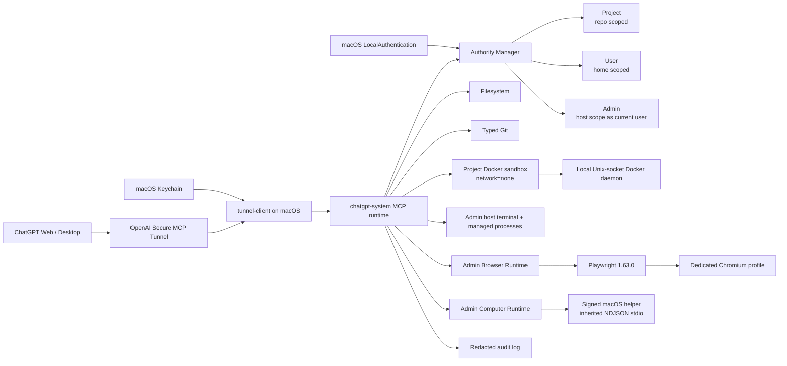

# chatgpt-system

<p align="center">
  <a href="https://github.com/senoldogann/chatgpt-system/actions/workflows/ci.yml"></a>
  
  
  
  
  
</p>

Secure local MCP authority gateway for controlled filesystem, Git, process, and browser automation from ChatGPT-compatible MCP clients.

`chatgpt-system` is deliberately not a permanently privileged natural-language shell. Authority is explicit, scoped, expiring, revocable, auditable, and enforced on the Mac. Browser automation follows the same rule instead of quietly becoming a side door around it.

## At a glance

| Capability | What it provides |
| --- | --- |
| **Secure MCP Tunnel** | Outbound-only personal ChatGPT connectivity without exposing a raw public MCP port |
| **Scoped authority** | Project, User, and Admin profiles with fixed local privilege boundaries |
| **Filesystem + Git** | Confined file operations plus typed Git read/write primitives |
| **Project execution** | Explicitly enabled, Project-only Docker sandbox with no network and no host fallback |
| **Admin / Owner execution** | Allowlisted `shell=false` commands plus explicitly gated unrestricted `shell_run` and persistent interactive PTY sessions |
| **Browser Runtime** | Admin-only semantic Playwright automation, screenshots, and bounded browser diagnostics |
| **Computer Runtime v2 Slice 5** | Native control plus semantic AX/OCR targets, bounded recovery, stale-target refusal, Admin-only full-host JavaScript, takeover safety, and redacted audit |
| **Jev semantic target resolution** | Admin-only, read-only, explicitly gated: resolves a natural-language instruction to an observed element index using TypeSafe's Jev model, with a mandatory "no match" option and a duplicate-description guard so it fails closed instead of guessing |
| **macOS trust** | LocalAuthentication for broad authority and Keychain-backed daily-driver credentials |
| **Daily driver** | LaunchAgent startup, automatic tunnel reconnect, bounded logs, and no routine Terminal ceremony |

## Architecture



The tunnel is transport, not authority. Privilege decisions remain local to the Mac. Admin still runs as the current macOS user rather than root. Browser automation and Computer Runtime are independently gated Admin capabilities; neither is a network or OS sandbox.

## Current implementation

The shared runtime currently includes:

- MCP TypeScript SDK v2 / 2026-07-28 protocol support;
- stdio and authenticated Streamable HTTP transports;
- personal ChatGPT Plugin path through OpenAI Secure MCP Tunnel;
- Project / User / Admin authority leases;
- direct Project authority from MCP with no host-terminal/browser-content capability;
- optional `project_exec` behind the separate `--enable-project-exec` gate, restricted to Project leases and a local Unix-socket Docker context with `network=none`, read-only container root, bounded resources, and no host-execution fallback;
- local User/Admin authorization through a private Unix socket and macOS LocalAuthentication;
- optional explicit personal-admin mode for a private daily-driver workstation;
- protected root-owned native approval helper with pinned SHA-256 metadata;
- filesystem confinement, symlink escape protection, optimistic SHA-256 mutation guards, and atomic replacement;
- typed Git status/diff/log/branch/stage/commit/merge/push operations;
- Admin-only allowlisted one-shot execution with `shell=false`;
- Admin-only managed process supervision with opaque IDs, bounded logs, and POSIX process-group cleanup;
- Admin-only deterministic Playwright Browser Runtime with semantic targeting and bounded diagnostics;
- browser credential-entry refusal and editable ARIA value redaction;
- Swift 6/macOS 14+ Computer Runtime v2 helper with strict bounded NDJSON over inherited stdin/stdout;
- passive Accessibility, Screen Recording, event-listen, and event-post readiness plus bounded app/window + AX observation and an 8 MiB ScreenCaptureKit screenshot path;
- deterministic app open/focus, pointer movement, click/double-click, mouse down/up, drag, scroll, Unicode typing, named keys/chords, and `release_inputs` on one serialized physical-action lane;
- one runtime-owned CoreGraphics event tag, listen-only takeover monitoring, fixed Control+Option+Command+Escape emergency stop, and deterministic AX/text/screen-region verification primitives;
- dedicated TypeScript native-host supervisor with fixed helper path, strict request/response correlation, crash/restart handling, bounded frames, and one shared `ComputerRuntime`;
- lease-free categorical `computer_health`, Admin-only strict `computer_*` MCP tools, and typed `computer_run`; in Admin Owner Runtime it has no legacy 100-action or implicit 30-second productivity cap, while returned step summaries and payloads remain bounded;
- stable daily-driver installer at `~/.chatgpt-system/ChatGPTSystemComputerRuntime.app`, preserving the fixed bundle ID `com.senoldogann.chatgpt-system.computer-runtime` and designated requirement across updates;
- Admin-only `computer_run_js` behind the separate `--enable-full-host-js` gate, using a fixed runner entrypoint, stdin-only source delivery, sanitized child environment, bounded source/output/result memory, private low-level computer RPC, and per-call process isolation; Admin Owner Runtime may omit the wall-clock deadline while explicit timeout/cancellation remain authoritative;
- semantic AX/label/text/index/point targets, focused-window Vision OCR fallback, bounded recovery, stale-snapshot refusal, `computer_scroll_until_visible`, and `computer_resolve_semantic_target`;
- JSONL audit trail with redacted authority/process/browser/computer metadata;
- localhost Host/Origin validation for HTTP mode; non-loopback HTTP is fail-closed unless `--allow-non-loopback-http` or `CHATGPT_SYSTEM_ALLOW_NON_LOOPBACK_HTTP=true` explicitly acknowledges an authenticated TLS reverse-proxy deployment;
- Node 22 / Node 24 / Node 26 CI plus native macOS build/install verification.

Computer Runtime v2 Slice 5 keeps the native physical-input layer deterministic while adding semantic AX/label/text/index/point targets, focused-window Vision OCR fallback, bounded recovery, stale-snapshot refusal, and scoped scrolling. `computer_run_js` remains a separate owner-trust full-host JavaScript boundary: it executes as the current macOS user with normal Node.js APIs, is not root-confined or an OS sandbox, delivers source only over stdin to a fixed child entrypoint, strips secret-bearing environment values, and cleans ordinary descendants through the owned POSIX process group. Deliberately detached or daemonized descendants remain outside that containment claim.

## Requirements

- Node.js 22 or newer
- npm
- Git
- Docker Desktop or another trusted local Docker daemon when `project_exec` is enabled; the active Docker context must resolve to a local Unix socket
- macOS + Swift/Xcode command-line tools for native User/Admin approval; the standalone Computer Runtime v2 helper specifically requires macOS 14+
- `tunnel-client` when using the personal ChatGPT Plugin route
- Chromium installed through the repository-pinned Playwright CLI when Browser Runtime is enabled

## Install and verify

```bash
git clone https://github.com/senoldogann/chatgpt-system.git
cd chatgpt-system
npm install
npm run check
```

For local stdio development:

```bash
npm run dev -- stdio --root /absolute/path/to/project
```

### Project execution sandbox

Project execution is disabled by default. Build the fixed local sandbox image once while a trusted local Docker daemon is running:

```bash
npm run setup:project-exec
```

Then start the runtime with the independent gate:

```bash
npm run dev -- stdio --root /absolute/path/to/project --enable-project-exec
```

`project_exec` accepts only a Project lease. The project root is bind-mounted at `/workspace`; container networking is disabled, the container root filesystem is read-only, and Docker/image/backend failures return `SANDBOX_UNAVAILABLE` rather than falling back to host execution. The sandbox is Linux-based, so macOS-native/Xcode tasks still require the existing explicit Admin host-execution path.

## Browser Runtime

Browser automation is disabled by default. Install the pinned Chromium binary once:

```bash
npm run setup:browser
```

The setup command accepts no browser/channel/command override. It invokes the repository-pinned Playwright CLI for Chromium with a bounded child-process lifetime.

Enable Browser Runtime explicitly:

```bash
npm run dev -- stdio \
  --root /absolute/path/to/project \
  --enable-browser
```

Optional headless mode:

```bash
npm run dev -- stdio \
  --root /absolute/path/to/project \
  --enable-browser \
  --browser-headless
```

Default browser configuration:

```text
CHATGPT_SYSTEM_ENABLE_BROWSER=false
CHATGPT_SYSTEM_BROWSER_HEADLESS=false
CHATGPT_SYSTEM_BROWSER_TIMEOUT_MS=10000
CHATGPT_SYSTEM_BROWSER_USER_DATA_DIR=~/.chatgpt-system/browser-profile
```

The default user-data directory is intentionally a dedicated automation profile. Do not point normal automation at your everyday Chrome/Chromium profile unless you deliberately accept the additional exposure.

Existing Chrome attach is a separate explicit mode for trusted use of the Chrome session you are already using, including existing authenticated state. On Chrome 144+, enable remote debugging yourself at `chrome://inspect/#remote-debugging`, then start with `--enable-browser --browser-existing-chrome`. Page/content access remains Admin-only, internal Chrome/extension/DevTools pages are not exposed, and runtime shutdown disconnects automation without intentionally closing the Chrome process or pre-existing tabs. See [docs/EXISTING_CHROME_ATTACH.md](docs/EXISTING_CHROME_ATTACH.md) for the consent, privacy, lifecycle, and non-default user-data-directory rules.

### Browser vs Computer Use routing

User intent wins over the generic web default. When a user explicitly asks for **Computer Use**, real Google Chrome, or physical pointer and keyboard interaction, use Computer Runtime end-to-end. For Chrome, open/focus bundle identifier `com.google.Chrome`, then use `computer_observe` / `computer_screenshot` and physical `computer_*` input tools. `browser_*` is semantic Playwright automation; do not use it for that explicit Computer Use workflow, and do not substitute Chrome for Testing for real Google Chrome.

Browser Runtime remains available when semantic Playwright automation is explicitly requested or when the user has not required Computer Use/physical desktop interaction. Existing-Chrome CDP attach is still Browser Runtime and therefore does not satisfy an explicit physical Computer Use request.

### Browser authority boundary

`browser_health` is lease-free and returns only categorical readiness.

All other browser tools require an active Admin lease because tabs, URLs, page content, screenshots, console output, and network diagnostics can reveal authenticated user-session information unrelated to a Project/User filesystem scope.

Project and User leases therefore cannot inspect or mutate browser content.

### Local action review (review only)

The local CLI can separately authenticate the macOS user and ask for confirmation of a caller-supplied, exact CLICK scope:

```bash
node dist/cli.js review-action --task-id task-1 --context-id context-1 --page-id page-1 --origin https://example.test --epoch 4 --target role:button:Submit
```

This requires a real interactive terminal and an installed, trusted macOS authority helper. The helper authenticates the **User profile only**; the terminal then asks for a separate, exact-scope review. The one-use result is consumed inside the CLI and is **not** an Admin/User lease, an MCP grant, proof of a ChatGPT conversation's intent, verification of actual browser state, or permission to click. The command never opens a browser or issues input. Without an interactive terminal, authentication, or explicit agreement it denies. Never pass `yes` by script or substitute this review for the unproven browser dispatch-time identity and uniqueness gate.

### Browser target model

Browser actions accept semantic targets only:

```text
role
text
label
testId
```

Raw CSS/XPath selectors, arbitrary JavaScript, generated Playwright code, cookies/storage APIs, CDP endpoints, proxy settings, executable paths, browser flags, request interception, and file-upload primitives are not exposed through MCP.

Navigation accepts only `http:` and `https:` URLs. Credential-shaped fields such as passwords, OTPs, verification codes, and payment-card secrets are refused before input reaches Playwright. Editable ARIA values are redacted before snapshots leave the runtime.

Browser shared-state operations use a shared serialization chain, page operations use independent per-page chains so unrelated pages do not block one another, and `browser_health` runs independently. Same-page ordering and close-time teardown waits remain enforced.

## Computer Runtime v2 Slice 5

Slice 3 established the Swift helper, TypeScript native-host supervisor, Admin policy, strict low-level MCP tools, bounded typed `computer_run`, stable installation, takeover handling, and shutdown integration. Slice 4 added the separately gated `computer_run_js` full-host execution layer. Slice 5 adds semantic targets, focused-window Vision OCR enrichment, bounded recovery, scoped scrolling, stale-snapshot refusal, and matching semantic helpers inside `computer_run_js`. The helper requires macOS 14+ and communicates only over inherited stdin/stdout using strict bounded NDJSON; there is no caller-selected native executable path.

Build, test, and stage the fixed background app bundle with:

```bash
npm run test:computer:macos
npm run build:computer:macos
npm run package:computer:macos
npm run build:computer-fixture:macos
npm run package:computer-fixture:macos

# Daily-driver install with a stable Keychain code-signing identity:
npm run setup:computer:macos
```

The disposable staged bundles and stable daily-driver location are:

```text
native/macos-computer-runtime/.build/staged/ChatGPTSystemComputerRuntime.app
native/macos-computer-runtime/.build/staged/ChatGPTSystemComputerRuntimeFixture.app
~/.chatgpt-system/ChatGPTSystemComputerRuntime.app
```

CI/staging packaging remains explicitly ad-hoc. `setup:computer:macos` instead reuses the currently installed signer when possible, accepts an exact valid `--identity`, or selects one unambiguous Apple Development/Developer ID identity. It never silently falls back to ad-hoc signing. `--ad-hoc-development` exists only for disposable development and reports that TCC identity is unstable.

The helper bundle identifier is fixed to `com.senoldogann.chatgpt-system.computer-runtime`; the synthetic local acceptance fixture is fixed to `com.senoldogann.chatgpt-system.computer-runtime.fixture`. `health` uses passive TCC preflight checks only. Physical posting/listening also uses passive preflight checks; the protocol does not request or bypass TCC. Screenshot capture and screen-region verification stay in memory.

Physical mutations are serialized and tagged with one runtime-owned CoreGraphics tag. A listen-only monitor ignores owned events, interrupts active automation on conservative unowned user input, and recognizes the fixed Control+Option+Command+Escape emergency chord. Verification uses bounded safe AX title/description state or in-memory screen-region digests; it does not read editable AX values or use OCR.

Slice 5 preserves the strict Computer Runtime authority boundary. `computer_health` is lease-free and categorical; every observation, screenshot, app-focus, physical-input, wait, release, `computer_run`, `computer_run_js`, and semantic-target operation requires Admin authority. `computer_run_js` additionally requires the independent `--enable-full-host-js` startup gate. It runs as the current macOS user with normal Node.js APIs and is not an OS sandbox or filesystem-root confinement boundary. Source is stdin-only, the child receives a sanitized environment with daemon secret-bearing environment values removed, and ordinary descendants are cleaned through the owned process group. Deliberately detached or daemonized descendants are outside that containment claim. Raw `mouse_down` / `mouse_up` remain absent as direct MCP tools but are available inside bounded typed `computer_run`. `computer_resolve_semantic_target` is read-only and Jev-gated; OCR and recovery remain bounded and focused-window-only.

### Jev semantic target resolution

`computer_resolve_semantic_target` is a separate, explicit, Admin-only, **read-only** capability: it never clicks, types, or moves input. Given a natural-language `instruction`, it takes a fresh `computer_observe` snapshot, asks [TypeSafe's Jev model](https://docs.typesafe.ai) which observed element (if any) matches, and returns either `{ outcome: "resolved", target: { by: "index", snapshotId, index }, confidence }` — ready to pass straight into `computer_click` / `computer_run` / `computer_move_mouse` — or `{ outcome: "unresolved", reason, confidence }`.

Disabled by default. Enable with `--enable-jev-targeting` (or `CHATGPT_SYSTEM_ENABLE_JEV_TARGETING=true`) plus a `TYPESAFE_API_KEY` environment variable ([console.typesafe.ai/keys](https://console.typesafe.ai/keys)); both `--enable-computer-use` and the API key are required, or the tool fails closed with `JEV_TARGETING_UNAVAILABLE`.

It resolves to `unresolved` instead of guessing whenever:
- Jev's own explicit `none` option was chosen (`reason: "no_match"`);
- confidence falls below the resolver's internal threshold (`reason: "low_confidence"`);
- the chosen element's description is identical to another candidate's (`reason: "ambiguous_duplicate"`) — added because duplicate/near-duplicate candidates (e.g. two identically labeled buttons) were observed to return confidently wrong answers with high reported confidence, so confidence alone is not treated as sufficient.

`computer_resolve_semantic_target` only ever suggests a target; it carries no authority beyond an observation, and the calling agent still performs the actual click through the existing Admin-gated computer tools.

## Personal ChatGPT Plugin

For a personal ChatGPT Developer Mode plugin, use OpenAI Secure MCP Tunnel so the Mac does not expose a public inbound MCP port.

Create the fixed Project execution image first if you want Project leases to run builds/tests without Admin host-terminal authority:

```bash
npm run setup:project-exec
```

Create the tunnel in OpenAI Platform, then configure the local profile. On one trusted private Mac, the explicit Owner Workstation preset composes the daily-driver capability set in one opt-in:

```bash
npm run setup:chatgpt -- \
  --root /absolute/path/to/disposable-test-project \
  --tunnel-id tunnel_xxxxxxxxxxxxxxxx \
  --owner-workstation \
  --doctor
```

`--owner-workstation` enables Personal Admin, Owner Runtime, structured host terminal/PTY capability, local Docker Project Exec, Computer Use, and full-host JavaScript. It is still current-user authority, **not root** and not an OS sandbox. macOS sudo, TCC, SIP, FileVault/login, and Keychain authentication boundaries remain authoritative. Browser Runtime stays independent and is never enabled by this preset; add `--enable-browser` separately only when the Playwright layer is intentionally wanted. The individual capability flags remain available for narrower configurations: `--enable-terminal`, `--enable-project-exec`, `--personal-admin`, `--enable-owner-runtime`, `--enable-computer-use`, and `--enable-full-host-js`. Omitting the preset preserves the secure defaults.

The configured `--root` is a **bootstrap/default root**, not a permanent "only this project" restriction. A Project lease may target another explicit repository path outside the bootstrap root with `session_authority_start(profile="project", projectRoots=[...])`; `/` and the entire home directory remain forbidden Project roots. For a new project, the recommended flow is: open the exact Project lease, `project_register` it once for continuity, then use `project_resume` in later chats. Reconfiguring the tunnel is not required for each repository.

Headless browser mode is optional:

```bash
npm run setup:chatgpt -- \
  --root /absolute/path/to/disposable-test-project \
  --tunnel-id tunnel_xxxxxxxxxxxxxxxx \
  --enable-terminal \
  --personal-admin \
  --enable-browser \
  --browser-headless \
  --doctor
```

`--browser-headless` without `--enable-browser` is rejected.

To use the already-running Chrome session instead of the managed Playwright profile, keep Chrome running, enable consent at `chrome://inspect/#remote-debugging`, and configure the tunnel with `--enable-browser --browser-existing-chrome`. Do not combine Existing-Chrome mode with `--browser-headless`; use it only when Admin-authorized access to the existing signed-in session is intended.

If the `chatgpt-system` tunnel profile already exists and its child command is stale, replacement is intentionally explicit. Re-run setup with `--force`:

```bash
npm run setup:chatgpt -- \
  --root /absolute/path/to/disposable-test-project \
  --tunnel-id tunnel_xxxxxxxxxxxxxxxx \
  --owner-workstation \
  --force \
  --doctor
```

`--force` replaces only the existing `tunnel-client` profile configuration. It does not delete repository data or bypass authority policy.

Run manually with:

```bash
tunnel-client run --profile chatgpt-system
```

ChatGPT Web is the canonical first acceptance surface. Desktop uses the same installed plugin/backend. Normal Chat and Work may route product safety differently, so actual MCP calls are the acceptance evidence that matters.

### ChatGPT Web custom-app availability recovery

If ChatGPT returns `This conversation does not support developer MCPs`, treat it as a **product surface / tool routing availability** problem, do not treat it as daemon failure or tunnel failure. Do not invent a local-host fallback and do not claim local changes, tests, or Git operations that were not actually performed.

If `@chatgpt-system-local` no longer appears or disappears from the current composer/tools surface, do not repeatedly keep trying the same unavailable `@` path. Selection on an earlier turn is not proof that the custom app is still available now.

Recovery flow for normal project work:

1. Return to a supported **standard text chat** surface. Agent mode does not use custom apps; Deep Research can use custom apps only for read/fetch actions, not write/modify actions.
2. If the app is actually available in the current chat, select it from the supported tools/apps surface. If it is absent or the conversation rejects developer MCPs, open a **new supported standard text chat** in the **same Project** instead of depending on `@mention` recovery in the broken conversation.
3. In the new chat, select the app from whatever supported apps/tools surface is available and ask to continue the exact project.
4. Once developer MCP tools are available again, the **first project action** is `project_resume` for the exact registered alias; reconcile Git/worktree reality before project mutation.
5. If tool/action definitions changed and the product exposes a supported **Refresh** action, use it to reload the current catalog. Do not disconnect/recreate the app merely to simulate refresh.

Tunnel-client can also log `command response deadline reached; dropping without posting a response` at INFO level; the diagnostic reports `MCP_RESPONSE_DEADLINE_EVIDENCE` separately from daemon/stdio failure. For a historical incident, use `npm run diagnose:chatgpt -- --minutes 30 --at 2026-09-19T19:05:30+03:00` with the actual offset-aware time. See the runbook for short managed-process polling and passive health snapshots.

`Connection interrupted. Waiting for the complete answer` is not evidence of local tunnel failure by itself. Do not restart an otherwise healthy tunnel solely for this Web-stream symptom; run `npm run diagnose:chatgpt` near the incident time to classify bounded local evidence. Container access is not the user's Mac and must not be substituted for an unavailable developer MCP surface.

Stopping and continuing the same chat is not itself proof that the custom app remains available on the next message. The agent must use actual MCP tool availability as evidence. Safety or product-surface routing must never be worked around by keyword substitution or by pretending container access is equivalent to the user's Mac.

See [docs/CHATGPT_WEB_RESILIENCE.md](docs/CHATGPT_WEB_RESILIENCE.md) for hosted stream/capability-loss recovery and safe local diagnostics, and [docs/CHATGPT_INTEGRATION.md](docs/CHATGPT_INTEGRATION.md) for the full integration runbook.

## macOS daily driver

After the tunnel profile is configured, the optional daily-driver service can keep `tunnel-client` running automatically at login. The one-time installer stores `CONTROL_PLANE_API_KEY` in the macOS login Keychain and installs a user LaunchAgent.

Before installing, stop any manually running tunnel process. Then run once from a shell where the credential is already available:

```bash
npm run setup:daily-driver
```

Maintenance commands:

```bash
npm run daily-driver:status
npm run owner-workstation:status
npm run daily-driver:uninstall
```

The LaunchAgent runs as the logged-in user. The dedicated `chatgpt-system-keychain-helper` owns app-specific Keychain store/read/delete operations; runtime reads fail closed rather than opening authentication UI. The tunnel credential is not written to the plist, repository, audit log, runner logs, or spawned command argv. `owner-workstation:status` is passive: it reports stable Computer Runtime identity, Accessibility/Screen Recording/event permission booleans, and non-interactive credential readability without changing TCC or Keychain policy.

## Authority privilege ladder

Every privileged filesystem/Git/process/browser-content call carries an opaque `authorityLeaseId`. The capability mapping is fixed by trusted local code and cannot be overridden by MCP input.

| Profile | Scope | Maximum lease | Host terminal/process | Project sandbox | Browser content/actions | Authority creation |
| --- | --- | ---: | --- | --- | --- | --- |
| `project` | Explicit project root(s) | 8 hours | No | Yes only when `--enable-project-exec` is enabled | No | MCP `session_authority_start` |
| `user` | Canonical current-user home | 4 hours | No | No | No | Local CLI + macOS authentication |
| `admin` | `/` host-wide scope under current OS user | 1 hour | Yes when runtime gate enabled | No; use a Project lease | Yes when browser gate enabled | Local CLI by default; MCP direct in personal-admin mode |

### Project authority

Project mode is the default for normal repository work:

```text
session_authority_start({
  profile: "project",
  projectRoots: ["/Users/you/Projects/my-app"]
})
```

It supports filesystem and built-in Git tools inside selected roots. These exact Project roots may be outside the tunnel's bootstrap/default root; a new tunnel profile is not required for another repository. When the independent Project execution gate is enabled, the same Project lease can also call `project_exec` inside those roots without gaining host-terminal authority. `/` and the entire user home directory are rejected as Project roots. Register the repository once with `project_register` when continuity is wanted, then use `project_resume` in later chats.

### User/Admin local authorization

By default broad authority starts physically on the Mac:

```bash
chatgpt-system authorize user
chatgpt-system authorize admin
```

The flow is:

```text
local CLI
   |
   v
~/.chatgpt-system/control.sock
   |
   v
protected root-owned LocalAuthentication helper
   |
   v
same in-memory AuthorityManager
   |
   v
expiring lease
```

The normal CLI copies the raw lease to the clipboard rather than printing it. `--print-lease` is an explicit diagnostic escape hatch.

## Protected native approval helper

Build as the normal user:

```bash
npm run build:broker:macos
```

Install with explicit administrator authorization:

```bash
sudo npm run install:broker:macos
```

Protected production paths:

```text
/Library/Application Support/chatgpt-system/bin/chatgpt-system-authority-broker
/Library/Application Support/chatgpt-system/etc/authority-broker.sha256
```

The runtime verifies path type, ownership, permissions, and SHA-256 identity before each User/Admin native approval. Repository-local `.build/release` output is never trusted as the production approval executable.

## Admin is not root

An Admin lease provides host-wide scope where the current OS account has permission and can enable structured terminal/process/browser capabilities when their independent runtime gates are enabled. It does not grant UID 0 and does not cache or expose sudo credentials.

True root-only operations remain a future typed ServiceManagement/XPC boundary, not password piping, `sudo -S`, passwordless sudo, or a reusable root shell.

## MCP tool surface

### System and authority

```text
system_capabilities
system_environment
session_authority_start
session_authority_status
session_authority_end
```

### Filesystem

```text
fs_list
fs_stat
fs_read
fs_write
fs_apply_patch
fs_mkdir
fs_move
fs_remove
```

### Git

```text
git_status
git_diff
git_log
git_create_branch
git_switch_branch
git_stage_paths
git_commit
git_merge_branch
git_push
```

`git_push` is a dual-authority publication gate. `authorityLeaseId` must be an active Admin lease and `projectAuthorityLeaseId` must be the exact active Project lease returned by `project_resume` for the registered worktree. Publication is denied on `main`, on a dirty tree, when resumed worktree identity no longer matches, or unless `project_check` reports a fresh `PASS` for the exact current `HEAD` + `workingTreeDigest`. The final Git refspec uses that verified commit SHA and the validated current branch; remote/refspec/force/branch/head verification overrides are not exposed to MCP callers.

An Admin lease supplied to `project_check run` for an `admin-host` native verification check authorizes only that local verification execution. `git_push` independently requires its own current Admin lease plus the exact resumed Project lease and a fresh `project_check report` `PASS`. Verification evidence stores categorical execution metadata plus output digests and byte counts; raw terminal stdout/stderr is not persisted.

### Sandboxed Project execution

```text
project_exec
```

`project_exec` requires a Project lease and the explicit Project-execution startup gate. It never falls back to `terminal_run`; Docker daemon/image/context failures fail closed.

**Persistent Owner Mode startup fast path:** For an existing registered project, call `project_resume` first. Reuse a valid Admin lease already available in the conversation, and defer Admin lookup for Project-only work. If an Admin action is needed but the lease is unavailable, call `persistent_owner_mode` with `operation: "status"` once; when enabled, it returns the existing non-expiring lease. Do not repeatedly start a new Admin session. Every privileged operation still requires its explicit valid `authorityLeaseId`; Project and Admin authorities are not interchangeable, and this does not change macOS or hosted product approvals.

### Owner Runtime full-host shell and PTY

```text
shell_run
terminal_session_open
terminal_session_read
terminal_session_write
terminal_session_resize
terminal_session_close
terminal_session_list
```

`Owner Runtime` is an explicit private-workstation capability for a locally approved Admin session. It requires `--personal-admin --enable-owner-runtime`; Personal Admin alone is not sufficient. `shell_run` executes arbitrary login-shell syntax through the trusted startup shell (macOS default `/bin/zsh`) as the current macOS user, including pipes, redirects, compound commands, installed compilers/package managers, normal host network access, and executable paths that are not in the structured terminal allowlist. It is **not an OS sandbox** and Project/User leases cannot use it.

Unlike `terminal_run`, `shell_run` has no inherited command allowlist or default legacy command wall-clock timeout. Caller-supplied finite timeout, MCP cancellation, and daemon shutdown terminate the owned process group. stdout/stderr retention remains bounded in memory and overflow drops old bytes instead of killing the job. The child receives the sanitized daemon environment; control-plane/authority secrets are not automatically forwarded. Audit stores only lifecycle metadata plus script byte count/SHA-256, never raw script, output, environment, or lease content.

`terminal_session_*` is the persistent interactive counterpart. `terminal_session_open` starts the same trusted login shell in a real PTY and returns an opaque daemon-local session ID, never an OS PID. Reads use a monotonic output-event cursor over a bounded UTF-8-safe in-memory ring; writes and resize requests are bounded; sessions may outlive the Admin lease that created them but only a later active Admin Owner Runtime lease can rediscover or operate them. Project/User cannot list or use PTYs. Sessions do not survive daemon restart, and daemon shutdown owns SIGTERM -> grace -> SIGKILL cleanup. PTY input/output and session identifiers are not durable audit content.

Owner Runtime also changes only the **productivity ceilings** of Computer Runtime for an approved Admin. `computer_run` may execute more than the legacy 100-action cap and, when `timeoutMs` is omitted, has no implicit 30-second program deadline. `computer_run_js` likewise has no implicit 30-second runner deadline in Owner mode. A supplied finite timeout, MCP cancellation, user takeover, the fixed emergency chord, and daemon/runtime shutdown remain authoritative. An already-issued native action is allowed to finish as one atomic operation bounded by the existing native request timeout; cancellation prevents later actions and cleanup releases held input. JS source/output/result, screenshots, observations, recovery retries, protocol frames, and returned `computer_run` step summaries remain bounded.

Use `terminal_run` for narrow deterministic argv/allowlist commands, `shell_run` for unrestricted one-shot shell work, and `terminal_session_*` when a compiler, REPL, debugger, prompt, or dev server genuinely needs a TTY or persistent interactive state.

### One-shot and managed host processes

```text
terminal_run
process_start
process_list
process_status
process_logs
process_stop
```

Process execution requires terminal-capable authority, currently Admin. MCP never accepts or returns OS PIDs, process-group IDs, arbitrary signals, shell mode, detached mode, or caller-provided child environments.

### Browser

```text
browser_health
browser_tabs
browser_new_tab
browser_select_tab
browser_close_tab
browser_navigate
browser_snapshot
browser_click
browser_fill
browser_select_option
browser_press_key
browser_wait_for_text
browser_screenshot
browser_console_errors
browser_network_errors
browser_close
```

`browser_health` needs no lease; every other browser tool is Admin-only.

Computer Runtime v2 Slice 5 exposes the following MCP surface:

```text
computer_health
computer_observe
computer_screenshot
computer_pointer_position
computer_open_app
computer_focus_app
computer_move_mouse
computer_click
computer_drag
computer_scroll
computer_type_text
computer_press_key
computer_release_inputs
computer_wait_for_frontmost
computer_wait_for_text
computer_wait_until_changed
computer_scroll_until_visible
computer_run
computer_run_js
computer_resolve_semantic_target
```

`computer_health` is lease-free; every other computer tool is Admin-only. `computer_run_js` additionally requires the explicit full-host JavaScript gate and returns only its bounded structured `stdout`, `stderr`, and optional JSON-compatible `result`; it does not report a synthetic cleanup-success field. `computer_resolve_semantic_target` additionally requires the explicit `--enable-jev-targeting` gate and a `TYPESAFE_API_KEY`; it is read-only and never clicks. Semantic physical actions and `computer_scroll_until_visible` use bounded fresh-observation/recovery rules and never guess coordinates. With Admin Owner Runtime enabled, omitted `computer_run` / `computer_run_js` timeout means no local productivity deadline, while finite timeout/cancellation/takeover/emergency/shutdown and all payload/memory/recovery bounds remain in force. Direct raw `computer_mouse_down` / `computer_mouse_up` are not registered. Hold primitives exist only inside typed `computer_run`, whose returned step-detail tail is bounded independently of the number of actions executed.

Every MCP tool declares explicit safety annotations and output schemas. Successful calls return readable text plus validated structured content.

## Conflict-safe file editing

Existing regular files cannot be blindly overwritten:

1. read/stat the file;
2. keep the returned SHA-256;
3. pass it as `expectedSha256` to the mutation;
4. a concurrent change returns `CONFLICT` without applying the mutation.

Creating a new file does not require `expectedSha256`.

## Process safety

`terminal_run` and `process_start` share:

- `shell=false`;
- executable basename allowlist;
- active authority cwd checks;
- sanitized environment;
- bounded execution/logging.

Managed processes additionally use opaque IDs and daemon-controlled stop semantics. On POSIX the daemon sends `SIGTERM`, waits the configured grace period, and escalates to `SIGKILL` only if required.

Neither structured one-shot/managed Admin host execution nor Owner Runtime `shell_run` / `terminal_session_*` is an OS sandbox. Owner tools are intentionally separate: `shell_run` is unrestricted one-shot login-shell execution, while `terminal_session_*` owns a persistent PTY with bounded retained output, opaque handles, later-Admin rediscovery, and daemon-shutdown process-group cleanup.

`project_exec` is a separate Docker isolation boundary: it accepts only Project leases, requires explicit startup opt-in, rejects non-local Docker contexts, disables container networking, uses a read-only container root plus bounded `/tmp`, and bind-mounts only the selected project root at `/workspace`. Its Linux environment may differ from the macOS host, and the Docker daemon itself remains trusted infrastructure. A missing/unhealthy daemon, missing fixed image, or backend failure is reported as `SANDBOX_UNAVAILABLE`; there is no host fallback.

## Verification and publication workflow

Normal repository development is local-first in `/Users/dogan/Desktop/chatgpt-system` on `main`. Create a branch only when explicitly requested; use a worktree only when explicitly requested or needed to protect another active owner. This local default is independent from publication: commit, GitHub push, PR, merge, and live deployment are separate operations with separate authorization.

`project_check detect` and `project_check report` are Project-scoped inspection operations. `project_check run` runs the detected Project-sandbox checks with the Project lease; a detected `admin-host` check, such as `package-script:test:computer:macos`, runs only when the call supplies a separate valid `adminAuthorityLeaseId`. The native Admin lease authorizes that verification only; it does not authorize `git_push`.

`git_push` remains a separate typed publication boundary. It requires the exact resumed Project lease, a current Admin `authorityLeaseId`, a clean non-`main` branch, and fresh overall `project_check report` `PASS` evidence bound to the exact HEAD and working-tree digest. A local `main` development workflow does not make direct main publication supported. If MCP tools are absent from a ChatGPT conversation, that is a product-surface/tool-routing availability problem, not removal of the local Admin/Project authority model; do not substitute containers or unsupported tools.

## Browser safety

Browser Runtime intentionally does not expose the full Playwright API. It is a narrow semantic capability with:

- independent startup opt-in;
- Admin-only page/content/action access;
- dedicated persistent automation profile;
- opaque in-memory page IDs;
- semantic locator allowlist;
- unique-target enforcement;
- HTTP(S)-only caller navigation;
- credential-shaped input refusal;
- editable-value snapshot redaction;
- bounded console/network diagnostics;
- query/fragment stripping from diagnostic URLs;
- in-memory screenshot delivery;
- shared-state serialization, independent per-page queues, and lease-free health probing;
- categorical/stable browser errors.

It is not a browser/network sandbox. Remote pages still execute in Chromium with the OS/network permissions available to that process.

## Shutdown behavior

Clean shutdown attempts resources in order:

```text
full-host JavaScript runner/process-group cleanup
      -> computer runtime / held-input cleanup
      -> managed processes
      -> browser runtime/context
      -> local authority control socket
      -> MCP transport/server
```

A cleanup error in one phase does not skip later phases.

## Audit

Default audit location:

```text
~/.chatgpt-system/audit.jsonl
```

Audit records are operational metadata, not a tamper-proof compliance log. Browser audit intentionally excludes page IDs, typed text, snapshots, screenshots, console payloads, cookies/storage, credentials, and URL query/fragment data. Computer audit records only constructed operation metadata such as action, outcome, duration, safe error code, and bounded batch counts; typed text, coordinates, AX/UI text, screenshot bytes, native stderr, request IDs, and authority lease IDs are excluded. `computer.run_js` audit also excludes JavaScript source, cwd, stdout, stderr, returned values, runner RPC IDs, native request IDs, and JavaScript exception text.

See [SECURITY.md](SECURITY.md) for the complete trust model and limitations.

## Testing

Main verification command:

```bash
npm run check
```

CI verifies:

- Node.js 22 build/tests;
- Node.js 24 build/tests;
- Node.js 26 build/tests;
- native macOS authority helper build/install contract;
- macOS Computer Runtime v2 Swift tests, deterministic fake-sink physical-input/verification tests, fixed helper + fixture `.app` packaging, four-field passive native readiness smoke, and installer CLI contract;
- TypeScript Computer Runtime protocol/supervisor/policy/MCP/batch/shutdown tests plus real built-runner full-host JavaScript integration and containment tests;
- setup CLI smoke contracts without downloading a browser binary.

Browser unit tests use injected/fake backends and do not require graphical Chromium in CI. Real browser acceptance is performed separately on the target Mac after merge.

## Documentation

Local development defaults to the authoritative Desktop checkout on `main`. Create a branch only when explicitly requested; use a worktree only when explicitly requested or needed to protect another active owner. This local workflow does not relax the separate commit, push, PR, merge, or deployment gates.

- [Security model](SECURITY.md)
- [Architecture](docs/ARCHITECTURE.md)
- [ChatGPT integration and acceptance runbook](docs/CHATGPT_INTEGRATION.md)
- [ChatGPT Web resilience runbook](docs/CHATGPT_WEB_RESILIENCE.md)
- [Coding Harness v2 operator runbook](docs/CODING_HARNESS_V2.md)
- [Codex local path](docs/CODEX_PLUS.md)
- [Browser Runtime design](docs/superpowers/specs/2026-09-09-browser-runtime-design.md)
- [Browser Runtime implementation plan](docs/superpowers/plans/2026-09-09-browser-runtime.md)

## Capability boundary

Browser Runtime remains the structured web layer. Computer Runtime v2 Slice 5 provides the separate native desktop-control layer through explicit Admin-gated MCP tools, bounded semantic/OCR recovery, scoped scrolling, typed `computer_run`, and separately gated owner-trust `computer_run_js`.

The remaining separate boundary is typed root-only ServiceManagement/XPC operations only when a concrete need justifies them. Historical design and implementation documents under `docs/superpowers/specs/` and `docs/superpowers/plans/` describe earlier or proposed states; they are not current runtime instructions.
